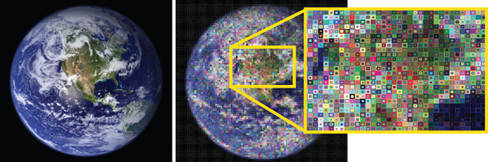

# Chuck Closify

The American painter, [Chuck Close](https://en.wikipedia.org/wiki/Chuck_Close)
is famous for his abstract portraits and images comprised of tiny, often
geometric, "mosaic tiles" that are arranged to evoke an image when viewed from
far away.  This MATLAB function provides a quick fix for those who want to
emulate Close's style but without putting in all that pesky hard work.



# Installation and setup

To "install" this function, simply save the `chuck_closify.m` file to your
computer or clone this repository, and then add the file to your MATLAB path.
This will give you access to a new function, `chuck_closify`.  For inline help,
type `help chuck_closify`.

# Using this function

The `chuck_closify` function takes in three required arguments and one optional
argument:  
- *image (required)*: an RGB image to be processed.  This can either
be a filename (string) or an RGB image matrix (rows by columns by 3).  This
specifies the source image that will be used to create the outputted "painting"
image.
- *rows (required)*: a positive integer.  Must be smaller than the number of
rows of pixels in the original image.  This specifies how many rows of mosaic
tiles to create in the outputted image.
- *columns (required)*: a positive integer.  Must be smaller than the number of
columns of pixels in the original image.  This specifies how many columns of
mosaic tiles to create in the outputted image.
- *outfile (optional)*: a string specifying a filename to write the new image
to. The image will be created as a vectorized PDF.  Do not specify a file
exension-- the extension ".pdf" will be added automatically.

## Example use

You can use `chuck_closify` to convert the image `earth.jpg` into a "painting"
with 25 rows and 30 columns, and save the output to `closified_earth.pdf` as
follows:
```matlab
>> chuck_closify('earth.jpg', 25, 30, 'closified_earth');
```